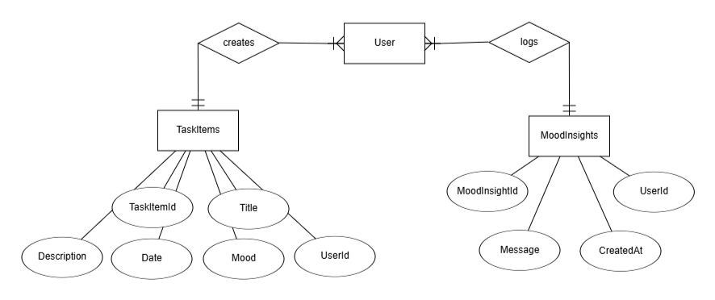

# *THE SleepSync PROJECT*

 SleepSync Is a project that focus on the well-being of both the user and it's tasks. At the same time it works as a traditional tasks planner, with the option to Create, Delete and Update your undone and done tasks throughout the Month, but also counts with the Mood Tracker functionality. Along with your new created tasks, you can insert your mood status before starting the task and update it after you're done, allowing you to keep track of your mental health, with the help of our Personalized Insights Tool, recommending tips on what could be done to improve your mood.

# KEY FEATURES:

**•	Daily Task Planning**

**•	Productivity Insights**

**•	Mood Tracking**

# BENEFITS:

**•	Daily Task Planning**

**•	Productivity Insights**

**•	Mood Tracking**

# TO-DO LIST:
- [x] Stablish the Project's Base idea
- [x] Include Create, Read, Update and Delete operations
- [ ] User Authentication & Authorization
- [ ] Include AI Insight assistant

# ERD（Entity Relationship Diagram）

